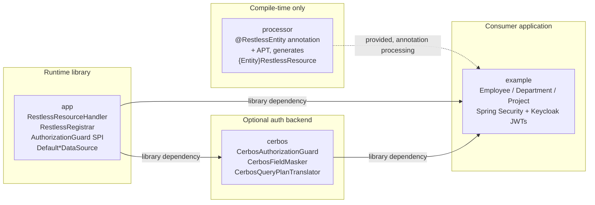
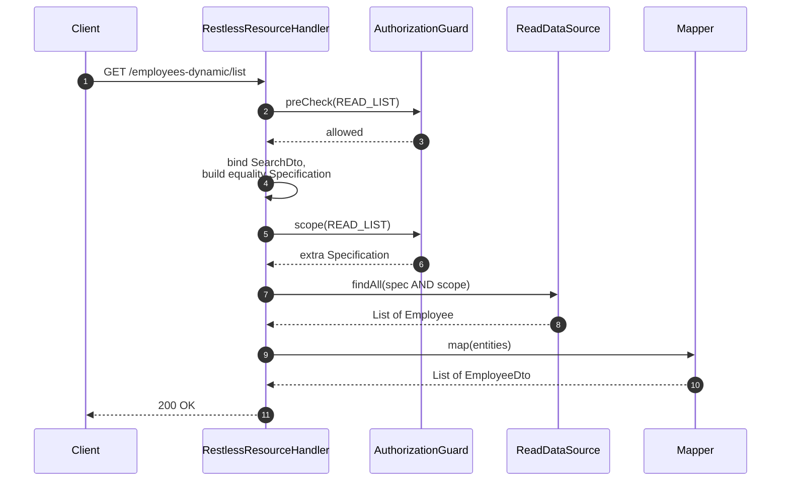
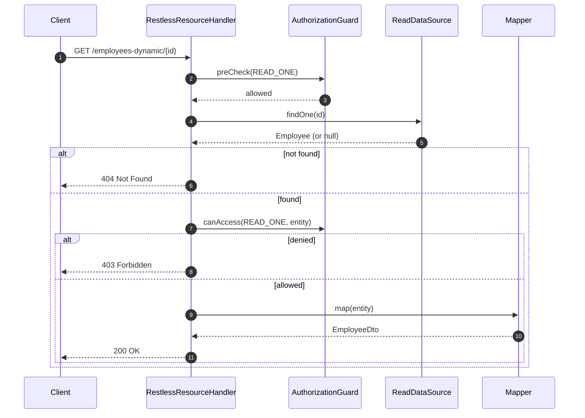
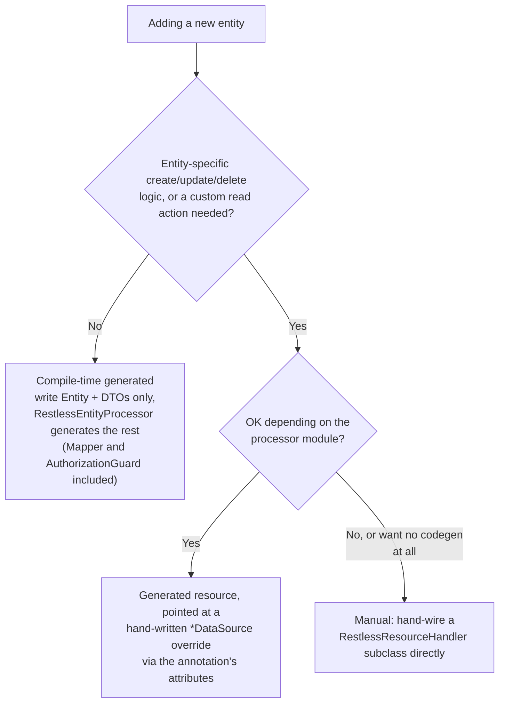

# spring-boot-restless


Annotation-driven REST CRUD for Spring Boot, built around DDD and volatility-based design:
each axis of change (persistence, mapping, HTTP wiring, authorization) is hidden behind its own
stable contract, so adding an entity means writing domain-meaningful code once and getting HTTP
for free — not hand-subclassing controllers or hand-writing plumbing classes. The actual point
of removing that boilerplate is to make room for the thing worth writing by hand for every
action: fine-grained authorization.

**At a glance:**

- 🚀 **Zero-boilerplate CRUD** — annotate an entity, get a full REST resource at startup, no hand-subclassed controllers.
- 🧩 **Three levels of control** — fully generated, hand-wired-but-default, or fully manual, chosen per entity, not globally.
- 🔒 **Authorization is a first-class seam**, not an afterthought — `AuthorizationGuard`'s three hook points (`preCheck`/`scope`/`canAccess`) sit on every route, framework-native and Spring-Security-agnostic.
- 🛡️ **Optional Cerbos backing** — policy-as-code (YAML) row-level scoping and field-level masking against a real PDP, demoed end-to-end with a real Keycloak IAM.
- ✋ **Mapping is never generated** — `Mapper<Entity, Dto>` stays hand-written on purpose, because response shape is exactly what authorization needs to control.

## Table of contents

- [Scope](#scope)
- [Prerequisites](#prerequisites)
- [Tech stack](#tech-stack)
- [Modules](#modules)
- [Architecture](#architecture)
- [How it works](#how-it-works)
- [Quickstart](#quickstart)
- [Tutorial: adding a new entity](#tutorial-adding-a-new-entity)
- [Tutorial: authorization with `AuthorizationGuard`](#tutorial-authorization-with-authorizationguard)
- [Tutorial: Cerbos-backed authorization](#tutorial-cerbos-backed-authorization)
- [Tutorial: hiding fields with `@CerbosHiddenField`](#tutorial-hiding-fields-with-cerboshiddenfield)
- [Running the full demo: Docker Compose + Keycloak](#running-the-full-demo-docker-compose--keycloak)
- [Resilience and observability](#resilience-and-observability)
- [API completeness](#api-completeness)
- [Project status](#project-status)

## Scope

This is **not** a Spring Data REST replacement or a full-blown low-code framework — it
deliberately keeps three things out of its own hands, because they're exactly where an app's
actual business rules live:

- **Response shape.** The DTO itself is always hand-written — a generated default would silently
  expose whatever fields an entity happens to have, which is the one surface fine-grained
  authorization needs to control. `Mapper<Entity, Dto>`'s *implementation* doesn't have to be:
  `RestlessEntityProcessor` can generate a reflective one (`BeanUtils.copyProperties`) once the
  DTO's shape is already decided, since copying an already-authored shape doesn't reintroduce the
  risk a generated *shape* would — see [Tutorial: adding a new entity](#tutorial-adding-a-new-entity).
- **Authorization.** Opt-in per resource, never mandatory boilerplate, and never tied to one
  auth stack — see [`AuthorizationGuard`](#tutorial-authorization-with-authorizationguard). The
  `cerbos` module is one concrete backing for it (policy-as-code via a real PDP), not the only
  one it's designed for.
- **Anything a plain equality filter, or a hand-written `Specification`, can't already express.**
  Search filtering defaults to "equality-match on whichever `SearchDto` fields are populated,"
  and steps out of the way (override, or add a named custom read action) the moment that's not
  enough.

Everything else — wiring an entity's CRUD verbs to Spring MVC routes, the repository, the
create/update/delete plumbing — is boilerplate the library is happy to generate or default away.
See [Modules](#modules) for the three ways to add an entity, from fully generated to fully
hand-wired.

## Prerequisites

- **Java 25** and **Maven 3.9+** (a wrapper — `./mvnw` — is included, so a local Maven install
  isn't strictly required).
- **Docker** and **Docker Compose**, only if you want to run the `example` module's Cerbos +
  Keycloak-backed demo (`/employees-dynamic/**`) against real infrastructure instead of just the
  automated test suite. Nothing else in the reactor needs Docker — every module's own `mvn test`
  either needs no external service at all, or starts one itself via Testcontainers.
- No other IDP, database, or message broker needed — `example` runs against an in-memory H2
  database and Testcontainers-managed containers for its automated tests.

## Tech stack

| Concern | What's used |
|---|---|
| Language / build | Java 25, Maven (multi-module reactor) |
| Framework | Spring Boot 4.1.1 (Spring MVC, Spring Data JPA) |
| Compile-time codegen | A hand-written `javax.annotation.processing.Processor` (`processor` module) |
| Authorization backend (optional) | [Cerbos](https://www.cerbos.dev/) via `cerbos-sdk-java`, gRPC |
| Auth mechanism (demo) | Spring Security + OAuth2 Resource Server (JWT Bearer) |
| Identity provider (demo) | [Keycloak](https://www.keycloak.org/), via Docker Compose |
| Persistence (demo) | H2 (in-memory) |
| Boilerplate reduction | Lombok |
| API versioning | Spring Framework 7's own (`RequestMappingInfo.Builder.version(...)`) |
| Health/observability (optional) | Spring Boot Actuator (`CerbosHealthIndicator`, `cerbos` module) |
| Testing | JUnit 5, Spring Boot Test / MockMvc, Testcontainers, AssertJ |

## Modules

- **`processor`** — the `@RestlessEntity` annotation and the compile-time processor that
  generates a `{Entity}RestlessResource` glue class from it (see below). A separately-built
  artifact from `app` on purpose: an annotation processor can't process its own compilation unit.
- **`app`** — the framework itself (`RestlessResourceHandler`, `RestlessRegistrar`, the
  `Default*DataSource` classes, `AuthorizationGuard`, ...) and nothing else — a library, not a
  runnable application. Ships no entities and no `@SpringBootApplication` class; it's
  self-tested against small, generically-named, test-scoped fixtures (`Gadget`/`Gizmo`/
  `Sprocket`/`Doohickey` under `app/src/test/.../fixtures/`) that never leave the test jar, so the
  framework stays independently verifiable without depending on `example` existing or staying in
  sync. `Doohickey` is the live proof of the compile-time-generated tier's newest capabilities —
  a reflective default `Mapper`, an annotation-wired `AuthorizationGuard`, and API versioning
  (`version = "1"`, real `RequestMappingInfo`-level routing, not just a stored string) — all with
  nothing but the entity, its DTOs, and one small guard bean hand-written — see
  [Tutorial: adding a new entity](#tutorial-adding-a-new-entity).
- **`cerbos`** — optional [Cerbos](https://www.cerbos.dev/)-backed `AuthorizationGuard`
  implementation, plus opt-in field-level masking (`@CerbosHiddenField`). A separate module (not
  a package inside `app`) so consumers who don't want Cerbos never pull in `cerbos-sdk-java` or
  Spring Security transitively. See the [Cerbos](#tutorial-cerbos-backed-authorization) and
  [field-masking](#tutorial-hiding-fields-with-cerboshiddenfield) tutorials below.
- **`example`** — a standalone runnable Spring Boot application that consumes `app`, `processor`,
  and `cerbos` as a real external project would (see `ExampleApplication`), demonstrating
  realistic usage with the original `Employee`/`Department`/`Project` entities under its own
  `ro.cristivoicu.springbootrestless.example` package, including a real Cerbos PDP and Keycloak
  IAM wired up via the root `docker-compose.yml`.

## Architecture

Module boundaries follow the dependency edges below — `processor` is an annotation-processor-only
(`provided`-scope) dependency at compile time, never a runtime one; `cerbos` is a separate module
so consumers who don't want it never pull in `cerbos-sdk-java` or Spring Security transitively.



## How it works

A `RestlessResourceHandler<E, K>` composes an entity's four `*DataSource` classes (create, read,
update, delete — each its own volatility, independently pluggable) plus its `Mapper`s and
`Specification` builder, and declares concrete, shared handler methods (`create`, `findOne`,
`findList`, `findPage`, `findPageOverview`, `findPageSelect`, `update`, `deleteById`,
`deleteAll`, plus one `customRead` per declared named action). At startup, `RestlessRegistrar`
finds every bean annotated `@RestlessResource`, resolves its entity/id/DTO types via reflection,
and registers each handler method as a live Spring MVC route
(`RequestMappingHandlerMapping.registerMapping`) — the same mechanism Spring Data REST uses.

Two representative request flows, both funneling through the same `AuthorizationGuard` hook
points described in the [`AuthorizationGuard` tutorial](#tutorial-authorization-with-authorizationguard)
below — `preCheck` gates every action before any work happens, then either `scope` (list/page
reads) or `canAccess` (single-entity reads/updates/deletes) narrows it further:

**List/page read — `scope()` narrows the query:**



**Single-entity action — `canAccess()` checks the loaded row:**



**Defaulted away** (still overridable per entity when the default isn't enough):

- **Create/Update/Delete/Read** — `DefaultCreateDataSource`/`DefaultUpdateDataSource`/
  `DefaultDeleteDataSource`/`DefaultReadDataSource` (`datasource/defaults/`) copy DTO fields onto
  the entity via `BeanUtils.copyProperties` (create/update) or plain-delegate to the repository
  (read/delete) — read logic turned out to have no entity-specific behavior in practice, only
  the search *filter* does (see below).
- **Search filtering** — `getSpecification()` defaults to an equality predicate on whichever
  `SearchDto` fields are populated (skipping `null`/blank). Override it for anything a plain
  equality match can't express, or add a named **custom read action**
  (`getCustomReadActions()`, its own `SearchDto` + query logic, exposed at
  `GET {basePath}/actions/{name}`) alongside the default.
- **The `{Entity}RestlessResource` glue class itself** — see
  [Tutorial: adding a new entity](#tutorial-adding-a-new-entity) below.

**Deliberately not defaulted:** `Mapper<Entity, Dto>` and `AuthorizationGuard<E>` — see
[Scope](#scope) above for why.

## Quickstart

From the repo root:

```bash
# Build every module and install it into the local repo (needed once, so example's
# dependency on the cerbos module resolves).
./mvnw install

# Run the full test suite across the reactor (needs Docker running — a few classes
# start a real Cerbos PDP via Testcontainers).
./mvnw test

# Run the example app on its own (defaults to port 8080; H2 in-memory, no external
# services needed for the /employees, /departments, /projects routes).
cd example && ../mvnw spring-boot:run
```

The `/employees-dynamic/**` routes are the exception — they're wired to a real
`CerbosAuthorizationGuard` and require a live Cerbos PDP (and, for real JWTs rather than
`MockMvc`'s test helpers, a real IdP) to answer authorization checks at all. See
[Running the full demo](#running-the-full-demo-docker-compose--keycloak) below to exercise those
routes for real instead of just through the automated test suite.

## Tutorial: adding a new entity

Three approaches exist. Authorization is no longer a reason on its own to leave the
compile-time-generated tier — `authorizationGuard` (below) can wire a real guard into a generated
resource too — so what actually forces a manual resource is entity-specific CUD logic or a custom
read action. A *generic* guard implementation shared across entities (`CerbosAuthorizationGuard<E>`
— everything in `example` is exactly this case) needs one small named delegating bean per entity
first (see `authorizationGuard`'s note below) — real, but a one-time cost per entity, not a reason
to stay manual on its own: `Project` pays it (`ProjectAuthorizationGuardBean`) and still lives on
the generated tier. `Department` still stays manual for now — same delegating-bean move would work
for it too, just not done yet. `app`'s own test-only `Doohickey` fixture (see
[Modules](#modules) for why entity-specific test fixtures live in `app` at all) shows the
delegate-free case — its guard is hand-written *for* `Doohickey` specifically, not generic.



### Simplest — compile-time generated (`Doohickey`, `Project`)

Write the entity + DTOs, following the naming convention; everything else is generated at
compile time by `RestlessEntityProcessor` (see `target/generated-sources/annotations` after a
build) — Repository, Mapper, resource, guard wiring included:

1. **Entity** — `@Entity` with a no-arg constructor, annotated `@RestlessEntity(basePath = "...")`.
2. **DTOs** — `{Entity}CreateModel`, `{Entity}UpdateModel`, `{Entity}SearchDto`, `{Entity}Dto`,
   all in the same package, named exactly `{Entity}{Suffix}`. Response *shape* is the one thing
   that's always hand-written here — see `Mapper`'s javadoc — everything else about it is optional.

That's it — a missing `{Entity}Repository` **and now a missing `{Entity}Mapper`** are both
generated: a reflective `BeanUtils.copyProperties(entity, dto)`, matching fields by name onto the
DTO you already wrote. Mark a DTO field `@RestlessMapperExclude` to keep the generated mapper from
touching it at all (it's left at its Java default, e.g. `null`) — for a field a blind copy
genuinely shouldn't populate, not for per-caller access control (that's a different, runtime
concern — see [`@CerbosHiddenField`](#tutorial-hiding-fields-with-cerboshiddenfield), which this
isn't a substitute for).

For logic a generated default can't express, hand-write a class and point the annotation at it
instead of relying on the naming convention — every attribute defaults to "use the convention/
generated default":

```java
@RestlessEntity(basePath = "/widgets", createDataSource = WidgetCreateDataSource.class,
        authorizationGuard = WidgetAuthorizationGuard.class)
```

`createModel`/`updateModel`/`searchDto`/`dto`/`mapper` work the same way for DTOs/mappers that
don't follow the naming convention — the generated resource injects the hand-written class as a
constructor parameter, exactly like a hand-written resource bean would. `authorizationGuard` does
too: point it at a hand-written `AuthorizationGuard<Entity>` `@Component` and the generated
resource overrides `getAuthorizationGuard()` to return it, exactly like `Doohickey`'s
`DoohickeyAuthorizationGuard` — leave it unset and `RestlessResourceHandler`'s own
default-permissive `AuthorizationGuard.allowAll()` applies, same as always. One real limit worth
knowing: `Class<?>` attributes name one concrete class, not a parameterized type, so a *generic*
guard meant to back more than one entity (`CerbosAuthorizationGuard<E>` — see
[Cerbos-backed authorization](#tutorial-cerbos-backed-authorization) — is exactly this case) needs
a small named `@Component` per entity that implements `AuthorizationGuard<Entity>` and delegates
to it, rather than pointing this attribute at the generic class itself.

**API versioning** (Spring Framework's own — `@RequestMapping(version = ...)`, backing Spring
Boot 4): `@RestlessEntity(version = "1")` forwards verbatim onto the generated resource's own
`@RestlessResource(version = "1")`, and every route `RestlessRegistrar` registers for it carries
that version via `RequestMappingInfo.Builder.version(...)` — real routing, not just a stored
string; `Doohickey` declares `version = "1"` for exactly this proof (see
`DynamicRouteVersionTest`). Left unset (the default), a resource's routes carry no version
constraint at all, exactly like an unversioned `@RequestMapping`. This only declares *which*
version a resource belongs to — *how* a request's version is resolved (header, path segment,
query param, media type parameter) is an app-wide `ApiVersionConfigurer` concern, same as any
hand-written `@RequestMapping(version = ...)` controller needs; see
`SpringBootRestlessApplication`'s `apiVersioningConfigurer()` bean (`app`'s own test config) for a
worked example, header-based. One real gotcha it also documents: `detectSupportedVersions(true)`
won't see a version a `@RestlessEntity`/`@RestlessResource` declares — that auto-detection scans
ordinary `@RequestMapping` beans during `RequestMappingHandlerMapping`'s own startup pass, before
`RestlessRegistrar` has dynamically registered anything at all. List a resource's versions
explicitly via `addSupportedVersions(...)` instead.

**Selecting which routes get registered**: `RestlessResourceHandler#getEnabledOperations`
defaults to every fixed route (`ALL_OPERATIONS`); `@RestlessEntity(operations = ...)` forwards the
same choice onto the generated resource, overriding `getEnabledOperations()` for you when it's
anything less than everything — e.g. a read-only resource:

```java
@RestlessEntity(basePath = "/cogs",
        operations = {RestlessOperation.READ_ONE, RestlessOperation.READ_LIST, RestlessOperation.READ_PAGE})
```

`RestlessRegistrar` filters `RestlessRegistrar.ROUTES` against the enabled set before registering
anything, so a disabled operation's routes aren't just guarded off — they're never registered at
all (the app fixture's `Cog`/`CogGeneratedResourceTest` proves this: `POST`/`PUT`/`DELETE` against
`/cogs` come back `405`, the same as any other method Spring never mapped). `PATCH` and named
custom read actions aren't part of this set — they're already independently opt-in via
`patchDataSource`/custom read actions, so there's nothing here to additionally gate for them. One
real limit: unlike a hand-wired resource overriding `getEnabledOperations()` directly, disabling an
operation here doesn't relax the naming-convention requirement on its DTO — `createModel`/
`updateModel` still have to resolve to something even with `CREATE`/`UPDATE` excluded, since this
attribute governs routing, not DTO resolution. A resource that should need no `{Entity}CreateModel`
at all belongs on the manual tier instead.

`Project` is the worked example of that delegating-bean case: `ProjectAuthorizationGuardBean`
wraps a `CerbosAuthorizationGuard<Project>` (row-scoped by department for non-managers, see
[Tutorial: Cerbos-backed authorization](#tutorial-cerbos-backed-authorization) below), and
`@RestlessEntity(createDataSource = ProjectCreateDataSource.class, authorizationGuard =
ProjectAuthorizationGuardBean.class)` on `Project` itself wires both hand-written pieces in.
Nothing else about `Project` is hand-written any more — no `ProjectRestlessResource`, no
`ProjectRepository`, no `ProjectMapper` (its DTO's fields already matched the entity's own by
name, so the generated reflective one needed no `@RestlessMapperExclude` either).

### Manual — runtime defaults, no codegen (`Department`)

Same generated-default CUD behavior, wired by hand instead of by the processor — useful for
understanding what the generated code actually does, avoiding the `processor` module dependency,
or avoiding a delegating wrapper bean for a generic guard implementation (the move `Project` above
makes instead):

1. **Entity + Repository + DTOs + Mapper** — same as above, plus
   `{Entity}Repository extends SpecificationRepository<{Entity}, Long>` by hand.
2. **Resource bean** — `{Entity}RestlessResource extends RestlessResourceHandler<{Entity}, Long>`,
   `@Component @RestlessResource(basePath = "...")`, constructing the four `Default*DataSource`
   instances directly in its constructor, and overriding `getAuthorizationGuard()`.

Every verb is a `Default*DataSource`; the guard is role-only, no row-scoping — see
`policies/department.yaml`.

### Full manual (`Employee`)

Hand-written `*DataSource` classes for entity-specific create/update/delete logic, a named
custom read action, and an authorization guard — see `EmployeeRestlessResource`. Also keeps the
original hand-written `@RestController` classes at `/employees` (vs. `/employees-dynamic` for
the dynamic route) purely as a parity-testing baseline for `example`'s own test suite.

## Tutorial: authorization with `AuthorizationGuard`

`AuthorizationGuard<E>` (`app`, `authorization/`) is the framework-native hook — no Spring
Security dependency, since the base library has none: implementations are handed the raw
`HttpServletRequest` and read whatever your own auth stack already populated (a
`userPrincipal`, a header, a `SecurityContext`, ...). It's opt-in per resource
(`RestlessResourceHandler.getAuthorizationGuard()`, default-permissive), with three hook points
checked at different points in each action's control flow:

```java
public interface AuthorizationGuard<E> {

    // Coarse, before any work: "can this principal even attempt this action at all".
    // Denial short-circuits with 403 before touching the database.
    default boolean preCheck(Action action, String customActionName, HttpServletRequest request);

    // Row-level restriction for read actions: an extra Specification ANDed onto whatever
    // filter the action would otherwise use. null means unrestricted.
    default Specification<E> scope(Action action, String customActionName, HttpServletRequest request);

    // Per-instance check once a specific entity has been loaded (single read/update/delete):
    // "can this principal act on THIS row specifically".
    default boolean canAccess(Action action, HttpServletRequest request, E entity);
}
```

Wire one in by overriding `getAuthorizationGuard()` on a `RestlessResourceHandler` subclass and
returning your own implementation — it can be as simple as a header check, or as involved as the
Cerbos-backed one below. `AuthorizationGuard.allowAll()` (the default) is a shared, reference-
comparable no-op — implement none of the three hooks and every action is unconditionally allowed.

## Tutorial: Cerbos-backed authorization

The `cerbos` module's `CerbosAuthorizationGuard<E>` implements `AuthorizationGuard<E>` against a
real [Cerbos](https://www.cerbos.dev/) PDP instead of hand-rolled guard logic, so authorization
rules live as policy-as-code (YAML, hot-reloadable, testable independently of the app) rather
than Java `if`s. It maps the three hook points onto Cerbos's own API:

- `preCheck` / `canAccess` → `CerbosBlockingClient.check(...)` (coarse and per-instance checks).
- `scope` → `CerbosBlockingClient.plan(...)`, translated from Cerbos's query-plan protobuf AST
  into a JPA `Specification` by `CerbosQueryPlanTranslator` (fails loud on any unsupported
  operator/shape, rather than silently under-restricting).

The full round trip for a `bob-manager` list request (see [Running the full demo](#running-the-full-demo-docker-compose--keycloak)
below for the real curl-able version), combining row-level `scope` with field-level masking:

```mermaid
sequenceDiagram
    autonumber
    participant C as Client
    participant G as CerbosAuthorizationGuard
    participant PDP as Cerbos PDP
    participant Mp as EmployeeMapper
    participant Mk as CerbosFieldMasker

    C->>G: findList (JWT: role=manager,<br/>scopedLastName=Hopper)
    G->>PDP: check(principal, synthetic resource, read_list)
    PDP-->>G: EFFECT_ALLOW
    G->>PDP: plan(principal, "employee", read_list)
    PDP-->>G: query-plan AST
    G->>G: CerbosQueryPlanTranslator -><br/>Specification&lt;Employee&gt;
    Note over G,C: lastName = 'Hopper' ANDed<br/>onto the search filter
    G-->>C: rows where lastName = Hopper only

    Mp->>Mk: maskAll(dtos, action="view")
    Mk->>PDP: batched check + output (per row)
    PDP-->>Mk: hidden fields: ["salary"]<br/>(no canViewSalary claim)
    Mk-->>Mp: dtos with salary = null
```

### 1. Add the dependency

```xml
<dependency>
    <groupId>ro.cristivoicu</groupId>
    <artifactId>spring-boot-restless-cerbos</artifactId>
    <version>0.0.1-SNAPSHOT</version>
</dependency>
```

### 2. Write a resource policy

One YAML file per resource kind (see `example/src/main/resources/policies/employee.yaml` for the
full worked example, including row-scoping and field masking):

```yaml
apiVersion: api.cerbos.dev/v1
resourcePolicy:
  version: default
  resource: employee
  rules:
    - actions: ["*"]
      effect: EFFECT_ALLOW
      roles: ["admin"]

    - actions: [read_one, read_list, update, delete_one]
      effect: EFFECT_ALLOW
      roles: ["manager"]
      condition:
        match:
          expr: >
            !has(request.resource.attr.lastName) ||
            request.resource.attr.lastName == request.principal.attr.scopedLastName
```

The `!has(...) ||` guard matters: `preCheck()` runs against a synthetic, attribute-less
resource (no entity has been loaded yet), so a bare equality condition would deny every attempt
outright before `scope()`/`canAccess()` — which always run with real attributes — ever get a
chance to do the actual per-row check.

### 3. Wire the guard into a resource

```java
@Override
protected AuthorizationGuard<Employee> getAuthorizationGuard() {
    return new CerbosAuthorizationGuard<>(cerbosClient, "employee", Employee::getId,
            employee -> Map.of("lastName", AttributeValue.stringValue(employee.getLastName())));
}
```

The last argument is a `CerbosResourceAttributesMapper<E>` — the entity-to-Cerbos-attributes
function used for `canAccess`/`scope`. Use `CerbosResourceAttributesMapper.reflective(Employee.class)`
instead of a hand-written lambda to expose every POJO field automatically, or `.none()` for a
policy that never needs resource attributes at all.

### 4. Resolve the principal from Spring Security

`CerbosPrincipalResolver` builds a Cerbos `Principal` from whatever
`SecurityContextHolder`/`Authentication` your own auth stack already populated — it special-cases
`JwtAuthenticationToken` (the type `spring-boot-starter-oauth2-resource-server` produces) to
expose the JWT's claims as principal attributes automatically, which is how
`scopedLastName`/`canViewSalary` above end up available to policy conditions. No code needed here
beyond having Spring Security populate the security context as usual.

### 5. Principal attributes that aren't JWT claims

Sometimes the attribute a condition needs isn't something the IdP was configured to issue at all
— "which department does this user belong to," resolved from that user's own row in your own
database, say, rather than a Keycloak custom attribute. `CerbosAuthorizationGuard`'s six-argument
constructor takes a `principalAttributesExtender` — a `Function<HttpServletRequest,
Map<String, AttributeValue>>` called after `CerbosPrincipalResolver` builds the JWT-derived
principal, merged on top of it additively:

```java
public ProjectAuthorizationGuardBean(CerbosBlockingClient cerbosClient, EmployeeRepository employeeRepository) {
    this.employeeRepository = employeeRepository;
    this.delegate = new CerbosAuthorizationGuard<>(cerbosClient, "project", Project::getId,
            project -> Map.of("departmentCode", AttributeValue.stringValue(project.getDepartmentCode())),
            CerbosActionNaming.DEFAULT,
            this::ownDepartmentAttribute); // looks up the caller's own Employee row
}
```

`example`'s `ProjectAuthorizationGuardBean` uses exactly this to back `policies/project.yaml`: a
non-manager can only read projects in their own department, where "their own department" comes
from looking up the authenticated principal's own `Employee` row (matched by the JWT's `email`
claim) rather than a claim Keycloak issues directly — see its javadoc for the full lookup and why
the condition guards both sides with `has()` (an employee whose department can't be resolved
correctly sees nothing, rather than the check erroring).

## Tutorial: hiding fields with `@CerbosHiddenField`

Row-level access (`preCheck`/`canAccess`/`scope`) answers "can this principal see/modify this row
at all" — it's a yes/no per row. `@CerbosHiddenField` + `CerbosFieldMasker` answer a finer
question on top of that: *which individual fields* of an already-visible row should this
principal not see. Deliberately opt-in and hand-called (consistent with `Mapper` never being
reflective) — it's a tool reached for explicitly inside a `Mapper`, not something that fires on
its own.

It uses Cerbos's **output** feature: a policy rule can attach an arbitrary CEL-computed value to
its decision, evaluated only when that rule activates. Model "which fields to hide" as a CEL list
of field-key strings:

```yaml
    - actions: ["view"]
      effect: EFFECT_ALLOW
      roles: ["manager"]
      output:
        when:
          ruleActivated: |-
            request.principal.attr.canViewSalary == true ? [] : ["salary"]
```

Annotate the DTO field to hide:

```java
public class EmployeeDto implements EntityDto {
    ...
    @CerbosHiddenField
    private BigDecimal salary;
}
```

And call the masker from the `Mapper`, after building the DTO — once per entity, or batched for a
list/page read (one Cerbos RPC for the whole page instead of one per row):

```java
// Single entity:
CerbosFieldMasker.mask(cerbosClient, principal, resource, "view", dto);

// A list — one batched RPC via client.batch(...) instead of N:
CerbosFieldMasker.maskAll(cerbosClient, principal, "employee", "view", dtos,
        EmployeeDto::getId, CerbosResourceAttributesMapper.none());
```

If the checked action has no matching policy rule for a principal at all, nothing gets masked —
this is a *refinement* layered on top of row-level access already granted, not a replacement for
it. Always pair a masking rule (`view` above) with every role/attribute combination that should
reach the mapper at all. See `EmployeeMapper`/`EmployeeDto`/`policies/employee.yaml` in `example`
for the complete worked example (masks `salary` for managers without a `canViewSalary` claim,
leaves it alone for admins and for managers who have it).

## Running the full demo: Docker Compose + Keycloak

`example`'s `/employees-dynamic/**`, `/departments/**`, and `/projects/**` routes are all secured
end-to-end with real infrastructure: a real Cerbos PDP evaluating every policy under
`policies/`, and a real [Keycloak](https://www.keycloak.org/) realm issuing JWTs that
`SecurityConfig` validates against Keycloak's own OIDC discovery document
(`spring.security.oauth2.resourceserver.jwt.issuer-uri`) — no fixed demo secret, no fake tokens.

```bash
# Start Cerbos (loads example/src/main/resources/policies) and Keycloak (auto-imports
# docker/keycloak/restless-demo-realm.json) in the background.
docker compose up -d

# Build once so `example`'s dependency on the cerbos module resolves, then run the app
# on a different port than Keycloak's 8080.
./mvnw install
cd example && ../mvnw org.springframework.boot:spring-boot-maven-plugin:run \
    -Dspring-boot.run.arguments=--server.port=8081
```

Demo accounts (see `docker/keycloak/README.md` for the full table and how to mint a token):

| username | role | `scopedLastName` | `canViewSalary` |
|---|---|---|---|
| `alice-admin` | admin | — | — |
| `bob-manager` | manager | `Hopper` | `false` |
| `carol-manager` | manager | `Lovelace` | `true` |
| `dave-employee` | employee | — | — |

```bash
TOKEN=$(curl -s http://localhost:8080/realms/restless-demo/protocol/openid-connect/token \
  -d grant_type=password -d client_id=restless-example \
  -d username=carol-manager -d password=carol-manager-pw | jq -r .access_token)

curl -s -H "Authorization: Bearer $TOKEN" http://localhost:8081/employees-dynamic/list | jq
```

`bob-manager` only sees employees whose `lastName` is `Hopper` (row-level `scope`), and always
gets `salary: null` on them (field-level masking — no `canViewSalary`); `carol-manager` sees the
same shape of row-scoping for `Lovelace` employees, with the real `salary` value; `alice-admin`
sees everything, unconditionally, salary included.

### Department-scoped project visibility

`dave-employee`'s `employee` role is scoped to their own department on `/projects`
(`policies/project.yaml`) — but "their own department" is resolved from their own `Employee`
row, not a JWT claim (see [step 5](#5-principal-attributes-that-arent-jwt-claims) above), so
that row needs to exist first, with a `departmentCode` and an `email` matching the token:

```bash
ADMIN_TOKEN=$(curl -s http://localhost:8080/realms/restless-demo/protocol/openid-connect/token \
  -d grant_type=password -d client_id=restless-example \
  -d username=alice-admin -d password=alice-admin-pw | jq -r .access_token)

# dave-employee's own record - email must match the Keycloak user's email exactly.
curl -s -H "Authorization: Bearer $ADMIN_TOKEN" -H "Content-Type: application/json" \
  -d '{"firstName":"Dave","lastName":"Employee","email":"dave@restless-demo.example","departmentCode":"ENG"}' \
  http://localhost:8081/employees-dynamic

# One project per department.
curl -s -H "Authorization: Bearer $ADMIN_TOKEN" -H "Content-Type: application/json" \
  -d '{"name":"Apollo","departmentCode":"ENG"}' http://localhost:8081/projects
curl -s -H "Authorization: Bearer $ADMIN_TOKEN" -H "Content-Type: application/json" \
  -d '{"name":"Orion","departmentCode":"SALES"}' http://localhost:8081/projects

DAVE_TOKEN=$(curl -s http://localhost:8080/realms/restless-demo/protocol/openid-connect/token \
  -d grant_type=password -d client_id=restless-example \
  -d username=dave-employee -d password=dave-employee-pw | jq -r .access_token)

curl -s -H "Authorization: Bearer $DAVE_TOKEN" http://localhost:8081/projects | jq
```

`dave-employee` sees only `Apollo` (`ENG`, their own department); `bob-manager`/`carol-manager`
and `alice-admin` would see both projects, unconditionally — `policies/project.yaml` never scopes
`manager` by department at all, only `employee`.

```bash
docker compose down   # when you're done
```

## Resilience and observability

`CerbosAuthorizationGuard` fails **closed**, not open — a PDP that's slow past
`cerbos.client.timeout` (default `3s`, see `CerbosClientConfiguration`) or unreachable makes
`preCheck`/`canAccess` return `false` and `scope` return an always-deny `Specification`, logged at
WARN, rather than an unhandled 500 or (far worse) silently falling through to unrestricted access.
There's no fail-open switch by design: an authorization check that can't reach its policy source
has no basis to say yes. See `CerbosAuthorizationGuardFailClosedIT` (`cerbos` module) for the
PDP-dies-mid-test proof.

`CerbosHealthIndicator` (`cerbos` module, `@ConditionalOnClass` on Spring Boot Actuator's
`HealthIndicator` — only activates if the consumer already depends on `spring-boot-starter-actuator`
themselves) reports whether the PDP is actually reachable, independent of hitting a guarded route
to find out. `example` wires it in; `management.endpoint.health.show-details=always` in its
`application.properties` surfaces it on `/actuator/health` without needing a management-role
principal, since this demo has no such role modeled.

## API completeness

- **`PATCH`** — entirely opt-in (`@RestlessEntity(patchDataSource = ...)` or a resource overriding
  `getPatchDataSource()`), unlike the four mandatory CUD verbs: no route gets registered at all
  until one is provided. `DefaultPatchDataSource` is the reflective default — copies whichever
  `{Entity}PatchModel` fields the client actually sent (`null` means "not sent", not "clear it";
  a full `PUT` is still how a client explicitly nulls a field). Checked against its own
  `Action.PATCH` — deliberately not inherited from `Action.UPDATE`, so granting full-replace
  access never silently also grants partial-update access. See `Doohickey`/`DoohickeyPatchTest`
  (`app` module) for the worked example.
- **Bulk create/update** — `POST`/`PUT {basePath}/bulk`, unconditional (every resource already has
  a `CreateDataSource`/`UpdateDataSource`). `createAll`/`updateAll` default methods loop the
  single-item verb, same spirit as `Mapper<E,D>.map(List<E>)`'s own default. Bulk update's body is
  a JSON object keyed by id (`{"1": {...}, "2": {...}}`); every entry is validated, and (with a
  guard configured) every target loaded and `canAccess`-checked, before anything is written — the
  same fail-fast-before-mutating pattern bulk delete already used.
- **Multi-field sort** — `AbstractSearchDto`'s `sort` is a repeatable query param
  (`?sort=lastName,asc&sort=firstName,asc`), Spring Data's own convention. An unresolvable
  direction or a property that isn't an actual field on the entity both become a clean 400 (via
  `RestlessResourceHandler#pageableOf`) before any query runs, instead of Hibernate's own later
  and less clear failure.
- **One error response contract** — `RestlessExceptionHandler` (`app` module, `@RestControllerAdvice`
  at `Ordered.LOWEST_PRECEDENCE` — a consumer's own handler for the same exception type still
  wins) gives every route this framework registers, generated or hand-wired, the same JSON body:
  `{timestamp, status, error, message, path, details}` (`details` is field-level validation
  messages when relevant, empty otherwise). Before this existed, "the same error shape either way"
  (`ErrorResponseParityTest`'s whole premise) meant "the same shape Spring Boot's own defaults
  happened to produce" — undocumented and not this framework's to version.
- **OpenAPI discovery — a documented gap, not a fix.** `OpenApiDiscoverySpikeTest` (`example`
  module) confirms springdoc-openapi's usual `@RestController` scanning sees hand-written routes
  (`/employees`) but *not* routes `RestlessRegistrar` registers dynamically via
  `RequestMappingHandlerMapping.registerMapping(...)` — including `/projects`, even though it's
  compile-time generated, since the generated class is still a plain `@Component`, not a
  `@RestController`. A real fix needs a custom springdoc contributor walking
  `RequestMappingHandlerMapping` for Restless-owned routes; out of scope here, but the finding (and
  a regression-proof test for it) is checked in.

## Project status

Working proof of the runtime-registration mechanism, the compile-time generator (now including a
reflective default `Mapper` and annotation-wired `AuthorizationGuard`), the library/example split,
and a real Cerbos + Keycloak-backed authorization demo. Every entity `example` exposes now carries
a real `CerbosAuthorizationGuard` backed by its own policy (`employee`/`department`/`project`) —
row-level scoping (by JWT claim for `employee.yaml`, by a principal attribute resolved from
another entity's own row for `project.yaml`, see
[step 5](#5-principal-attributes-that-arent-jwt-claims)) and field-level masking both; `Project`
carries it while staying fully compile-time generated, via the delegating-bean pattern
`authorizationGuard` needs for a generic guard implementation (see
[Tutorial: adding a new entity](#tutorial-adding-a-new-entity)). The full reactor's `mvn test` is
green, including every Testcontainers-backed class (a live Cerbos PDP is started automatically for
those): `app`'s own suite (`app/src/test/.../fixtures/`, `.../registry/`) proves the framework
mechanism in isolation via `Gadget`/`Gizmo`/`Sprocket`/`Doohickey` — the last exercising the
generated default `Mapper`, `@RestlessMapperExclude`, an annotation-wired guard, API versioning,
and an opt-in `PATCH` route; `cerbos`'s suite proves the query-plan translator, the field masker,
the guard's three hook points (including fail-closed behavior against a killed PDP), the health
indicator, and `principalAttributesExtender`, all against a real PDP; `example`'s suite proves the
same mechanism through realistic, business-named usage — full route coverage, cross-resource
isolation, duplicate-`basePath` detection, error-response parity against a hand-written baseline,
default-CUD end-to-end behavior, custom read actions, bulk create/update, multi-field sort, and
every guard's row-scoping and (for Employee) field-masking scenarios. 106 tests across the reactor.
